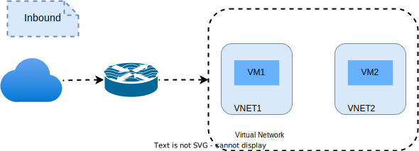
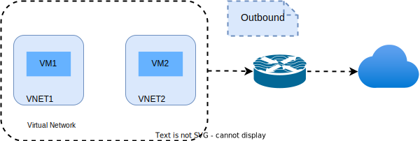

[<< Back to parent directory](../README.md) ]

[<< Back to DASH top-level Documents](../../README.md#contents) ]

# DASH key architectural elements

- [SONiC integration](#sonic-integration)
- [Processing pipeline](#processing-pipeline)
- [Processing pipeline](#processing-pipeline-1)
  - [Elastic Network Interface](#elastic-network-interface)
  - [Policy processing per ENI](#policy-processing-per-eni)
  - [Access Control Lists](#access-control-lists)
    - [Rules evaluation logic](#rules-evaluation-logic)
    - [Terminating versus non-terminating rule](#terminating-versus-non-terminating-rule)
  - [Routing](#routing)
    - [Outbound](#outbound)
    - [Inbound](#inbound)
    - [Route rules processing](#route-rules-processing)
- [Packet flow](#packet-flow)
- [References](#references)
- [Appendix](#appendix)
  - [Packet transforms](#packet-transforms)

This article describes some of DASH key architecturale elements.

## SONiC integration

DASH relies upon the [SONiC system
architecture](https://github.com/Azure/SONiC/wiki/Architecture) as shown in the figure below.
For more information and details about the integration, see [SONiC DASH
HLD](https://github.com/Azure/DASH/blob/main/documentation/general/design/dash-sonic-hld.md). 

<figcaption><i>Figure 1 - DASH architectural modifications to SONiC</i></figcaption>  

The previous figure shows the SONiC architectural modifications for DASH that
are summarized below. 

1. **SDN controller**. The SDN controller is primarily **responsible for
   controlling the DASH overlay services**, while the traditional SONiC
   application containers are used to manage the underlay (L3 routing) and
   hardware platform. 
      1. A **DASH API** is exposed as **gNMI interface** as part of the *gNMI
   container*, see next point. 
      1. **gNMI client** configures SONiC via `gRPC get/set` calls.

   The SDN controller controls the overlay built on top of the physical layer
   (underlay) of the infrastructure. From the point of view of the SDN control
   plane, when a customer creates an operation from the cloud portal (for
   example a VNET creation), the controller allocates the resources, placement
   management, capacity, etc. via the NorthBound interface APIs.

2. **gNMI container**. The SDN controller communicates with a DASH device
   through a **gNMI endpoint** served by a new DASH SDN agent running inside a
   new SONiC **gNMI container**.  
   1. **gNMI server**. The gNMI schema is closely related to the DASH DB schema
   so in effect, the *gNMI server* is a **thin RPC shim layer** to the DB.
   1. **Config Backend**. Translates SDN configuration into **confdb** OR
      **APPDB** objects.

    The functionality of the new **gNMI container** in the user
    space is to receive content from the Software Defined Networking (SDN)
    controller to control the setup for the overlay configurations. 
    DASH receives the objects, translates them with a **gNMI agent**, 
    provides them to the *SONiC OrchAgent* for further translation onto the 
    dataplane via the **SAI database**. 

3. **Switch State Service (SWSS) container** **DASH underlay** has a small
   initialization and supports a defined set of **SAI APIs**.
   1. **DASH orchestration agent (dashorch)**. **DASH Overlay** in the SWSS
    container that subscribes to the DB objects programmed by the **gNMI
    agent**. It transforms and translate these objects into ASIC_DB objects,
    including the new DASH specific SAI objects.
   2. **DASH orchestration agent (orchagent)**. It writes the state of each
      tables to STATEDB used by the applications to fetch the programmed status
      of DASH configured objects.
4. **sync-d container**. Provides **sai api DASH** that uses the orchestration
  agent ASICDB to allow the technology providers to program the DPU via their
  SAI implementation. This is a DASH enhanced sync-d that configures the
  dataplane using the technology supplier-specific SAI library.

  Both the DASH container and the traditional SONiC application containers sit
  on top of the Switch State services (SWSS) layer, and manipulate the Redis
  application-layer DBs; these in turn are translated into SAI dataplane obects
  via the normal SONiC orchestration daemons inside SWSS.

> [!NOTE] The *DPU/IPU/SmartNic* device will run a separate instance of SONiC
> DASH on the device.  

## Processing pipeline

## Processing pipeline

The processing pipeline must support both IPv4 and IPv6 protocols for both underlay and overlay, unless explicitly stated that some scenario is IPv4-only or IPv6-only. 

### Elastic Network Interface  

The Elastic Network Interface (ENI), is an independent entity that has a collection of routing policies. ENI has specified identification criteria, which are also used to identify **packet direction**. The current version only supports **mac-address** as ENI identification criteria. 
 
ENI created with identifier Mac1 assumes packets with **destination mac as Mac1 are inbound** and packets with **source mac as Mac2 are outbound**. This direction is used for matching appropriate inbound and outbound policies.  

Once a packet arrives on **Inbound** to the target (DPU), it must be forwarded to the correct ENI policy processing pipeline. 
This ENI selection is done based on the **inner destination MAC** of the packet, which is matched against the MAC of the ENI. 

### Policy processing per ENI

|Inbound|Outbound|
|-------|--------|
|||

- The **inbound pipeline** comprises these steps: `Network --> Routing --> ACLs --> VM`. Packets coming from the Network might be of the following types: 
  - Encapped within VNET traffic (from VM to VM) 
  - Encapped traffic from MUX to VM 
  - Encapped traffic from Device to VM 
  - Direct traffic from infrastructure to VM (ex. Node to VM) (no encap) 
- The **outbound pipeline** comprises these steps: `VM --> ACLs --> Routing --> Network`. Packet going outside to the Network might be of the following types: 
  - Direct traffic to Internet (no encap) 
  - Direct traffic to infrastructure (no encap) 
  - Encapped within VNET traffic (from VM to VM) 
  - Encapped traffic from VM to Device 

### Access Control Lists

Access Control Lists (ACLs) must support multiple level/groups and packets must successfully pass through these groups in order to be moved to the **routing** layer. Up to 3 ACL groups are supported in each direction. The order of the ACL groups evaluation is always the same and will not change. See the example below.

If there is no flow, the order of evaluation is as follows:

- **Outbound**  
  
  `VM -> ACLStage1 -> ACLStage2 -> ACLStage3 -> Routing`

- **Inbound**
  
  `Routing -> ACLStage1 -> ACLStage2 -> ACLStage3 -> VM`

**Each ACL group has a distinct set of rules**

ACLs are evaluated in both Inbound and Outbound direction and there are separate ACL groups for Inbound and Outbound. 

ACL evaluation is done in stages, where the Stage1 ACL is evaluated first, if a packet is allowed through Stage1 it is processed by Stage2 ACL and so on. For a packet to be allowed it must be allowed in all 3 Stages or must hit a terminating allow rule. 

The updating of the ACL Group (`ACLStage`) must be an atomic operation. No partial updates are allowed, as it might lead to security issues in the case of only partial rules being applied. 

**ACLs must be stateful**

The following isd an example of what it means to be stateful: 

- Customer has **allow** for Outbound traffic (to Internet), but **deny** for Inbound (from Internet) 
- VM must be able to **initiate traffic outbound** (which will be allowed by the outbound **allow** rule). This should then **automatically create temporary inbound allow rule for that specific flow ONLY to allow Internet to reply back (with SYN-ACK)**. 
- Internet **must not be able to initiate connection to VM if there is deny Inbound rule**. 

#### Rules evaluation logic 

The end result of the ACL logic for packet evaluation leads to a single outcome: **allow** or **deny**.

- If the **allow** outcome is reached the **packet is moved to next processing pipeline**. 
- If the **deny** outcome is reached the **packet is msilently dropped**. 

ACL groups need to be evaluated in order. 

- Each ACL group has a set of rules. Only a single rule can match in group/stage. 
  - Once the rule is matched, its action is performed (**allow** or **deny**).
  - The packet porcessing moves to the next ACL group/stage; a match is found, no further rules in same group are evaluated. 

- Within an ACL group, rules are organized by priority (with lowest priority number being evaluated first). 
  - No two rules have the same priority within a group. 
  - Priority is only within rules in the same group. No priorities across groups are allowed. 
  - A smaller priority number means the rule will be evaluated first.
  - Priorities are unique withing an ACL group. Priorities might overlap across ACL groups.  

#### Terminating versus non-terminating rule 

A rule can be **terminating** or **non-terminating**. 

- **Terminating** rule means that this is the final outcome and further processing through other groups/stages must be skipped. 
  - **Deny** rules are usually *terminating*. 

- **Non-terminating** rule means that further processing through other groups/stages is required. 
  - **Allow** rules are usually *non-terminating”*. 
  - **Deny** rules can sometimes be also *non-terminating* (also known as **soft deny**). This means that a particular ACL group *proposes* to deny the packet, but its decision is not final, and can be **overridden**, switched to *allow* by the next group/stage. 

### Routing 

Routing must be based on the **Longest Prefix Match** (LPM) and must support all **underlay and overlay** combinations: 

- inner IPv4 packet encapped in outer IPv4 packet 
- inner IPv4 packet encapped in outer IPv6 packet 
- inner IPv6 packet encapped in outer IPv4 packet 
- inner IPv6 packet encapped in outer IPv6 packet 

Routing pipeline must support the routing models shown below.

#### Outbound 

1. **Transpositions** 
   - Direct traffic – pass thru with static SNAT/DNAT (IP, IP+Port
   - Packet upcasting (IPv4 -> IPv6 packet transformation) 
   - Packet downcasting (IPv6 -> IPv4 packet transformation) 
1. **Encap** 
   - VXLAN/GRE encap – static rule 
   - VXLAN/GRE encap – based on mapping lookup 
   - VXLAN/GRE encap – calculated based on part of SRC/DEST IP of inner packet 
1. **Up to 3 levels of routing transforms** (example: transpose + encap + encap) 

#### Inbound 

1. **Decap** 
   - VXLAN/GRE decap – static rule 
   - VXLAN/GRE decap – based on mapping lookup 
   - VXLAN/GRE decap – inner packet SRC/DEST IP calculated based on part of outer packet SRC/DEST IP 
1. **Transpositions** 
   - Direct traffic – pass thru with static SNAT/DNAT (IP, IP+Port) 
   - Packet upcasting (IPv4 -> IPv6 packet transformation) 
   - Packet downcasting (IPv6 -> IPv4 packet transformation) 
1. **Up to 3 level of routing transforms** (example: decap + decap + transpose) 

All routing rules must optionally allow for **stamping** the source MAC (to **enforce Source MAC correctness**), `correct/fix/override source mac`. 

#### Route rules processing

**Outbound (LPM)**

Matching is based on destination IP only - using the Longest Prefix Match (LPM) algorithm. 

Once the rule is match, the correct set of **transposition, encap** steps must be applied depending on the rule. 

Only one rule will be matched. 

**Inbound (Priority)** 

All inbound rules are matched based on the priority order (with lower priority value rule matched first). 
Matching is based on multiple fields (or must match if field is populated). The supported fields are: 

- Most Outer Source IP Prefix 
- Most Outer Destination IP Prefix 
- VXLAN/GRE key 

Once the rule is match, the correct set of **decap, transposition** steps must be applied depending on the rule. 

Only one rule will be matched. 

## Packet flow

## References

## Appendix

### Packet transforms

Packet transformation plays a crucial role when moving a packet from a source to
a destination. Let's define a few terms.

- **Flow**. It describes a specific *conversation* between two hosts (SRC/DST
  IP, SRC/DST Port). When a flow is processed and policy is applied to it and
  then routed, the DPU (SmartNIC) records the outcomes of all those decisions in
  a **transform** and places them in the **flow table** which resides locally on
  the card itself.  

  > [!NOTE] This is why sometimes the terms *transform* and *flow* are used
  > interchangeably.

- **Transform**. It is represented either by *iflow* (initiator) or *rflow*
  (responder) in the **flow table**. It **contains everything the DPU needs to
  route a packet to its destination without first having to apply a policy**.
  Whenever the DPU receives a packet, it checks the local *flow table* to see if
  the preparatory work has been done for this flow. The following can happen:

  - When a *transform* or *flow* doesn’t exist in the *flow table*, a **slow
    path** is executed and policy applied.
  - When a *transform* or *flow* does exist in the *flow table*, a **fast path**
    is executed and the values in the transform are used to forward the packet
    to its destination without having to apply a policy first.

- **Mapping table**. It is tied to the V-Port, and contains the CA:PA (IPv4,
  IPv6) mapping, along with the FNI value of the CA for Inner Destination MAC
  re-write and VNID to use for VXLAN encapsulation.

  > [!NOTE] The Flexible Network Interface (FNI) is a 48-bit value which easily
  > maps to MAC values. The MAC address of a VNIC (VM NIC or BareMetal NIC) is
  > synonymous with FNI. It is one of the values used to identify a V-Port
  > container ID.  

- **Routing table**. It is a match.action table, specifically a longest prefix
  match (LPM) table that once matched on destination specifies the action to
  perform VXLAN encapsulation based on variables already provided, VXLAN encap
  using a **mapping table** or *Overlay Tunnel* lookup for variables, or *L3/L4
  NAT*. Routing tables are mapped to the V-Port.

- **Flow table**. A global table on a DPU that contains the transforms for all
  of the per-FNI flows that have been processed through the data path pipeline.

