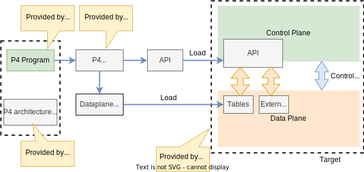

[<< Back to parent directory](../README.md) ]

[<< Back to DASH top-level Documents](../../README.md#contents) ]

# P4 language background

This article is an overiew of the **Programming Protocol-independent Packet
Processors** (P4) language. For more in depth information, please refer to the
official documentation [P4 Open-Source Programming Language](https://p4.org/).

## Overview

P4 is a domain-specific language for network devices, specifying how these
devices process packets. It is designed to be implementable on a large variety
of targets including programmable **network interface cards** (NIC), **FPGAs**,
**software switches**, and **hardware ASICs**. As such, the language is
restricted to constructs that can be efficiently implemented on all of these
platforms.

Before we go any further, let's define some terns. 

- **Control plane**. It comprises a class of algorithms and the corresponding
  input and output data that are concerned with the **provisioning** and
  **configuring** of the **data plane**.
- **Data plane**. It comprises a class of algorithms and data that are concerned
  with the **transformations** on **packet by packet processing systems**. 

P4 is concerned about the data plane that is the **transformations** on **packet
by packet processing systems**.

> [!NOTE] The DASH project does not provide and/or mandate any P4
> implementation. Instead, it uses P4 to **define the dataplane behavioral
> model** as the "gold standard". The technology providers use this model to
> implement their dataplane logic. Notice that this implementation does not have
> to be in P4.

## P4 programmable devices

A P4 programmable silicon device differs from a traditional one in two essential
ways:

1. The **data plane** functionality is not fixed in advance, as trditionally
   done by the devices manufacturers, but is defined by a P4 program. The data
   plane is configured at initialization time to implement the functionality
   described by the P4 program and has no built-in knowledge of existing network
   protocols.
2. The **control plane** communicates with the data plane using the same
   channels as in a fixed-function device, but the set of tables and other
   objects in the data plane are no longer fixed, since they are defined by a P4
   program. The P4 compiler generates the API that the control plane uses to
   communicate with the data plane. Hence, P4 can be said to be **protocol
   independent**, but it enables programmers to express a rich set of protocols
   and other data plane behaviors.

For now on, we'll call a P4 programmable device a **target**.

The following figure shows the workflow when programming a device using P4.

<figcaption><i>Figure 1 - P4 workflow to program a target</i></figcaption>  

- Target manufacturers provide the **hardware or software implementation
  framework**, an **architecture definition**, and a **P4 compiler** for that
  target.
- P4 programmers write **programs for a specific architecture**, which defines a
  **set of P4-programmable components on the target** as well as **their
  external data plane interfaces**.

Compiling a set of P4 programs produces two artifacts:

- A **data plane configuration** that implements the forwarding logic described
  in the input program.
- An **API** for managing the state of the data plane objects from the control
  plane.

> [!NOTE] The computational complexity of a P4 program is linear in the total
> size of all headers, and never depends on the size of the state accumulated
> while processing data (e.g., the number of flows, or the total number of
> packets processed).
