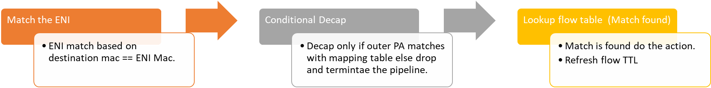
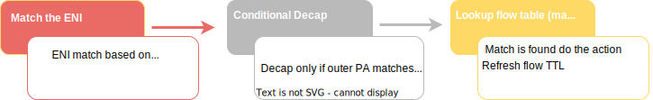
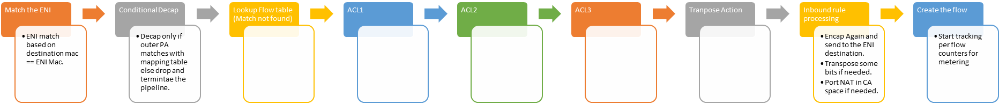
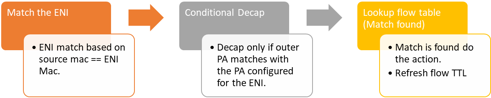
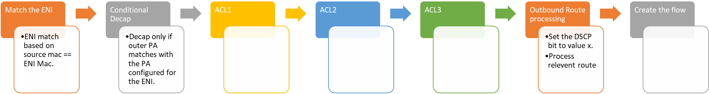

# Packet flow

- [Applicable rules](#applicable-rules)
- [Inbound](#inbound)
  - [Fast Path - Flow Match](#fast-path---flow-match)
    - [Old image (Inbound fast path flow match)](#old-image-inbound-fast-path-flow-match)
    - [New image (Inbound fast path flow match)](#new-image-inbound-fast-path-flow-match)
    - [Slow Path - No flow match](#slow-path---no-flow-match)
  - [Outbound](#outbound)
    - [Fast path - flow match](#fast-path---flow-match-1)
    - [Slow Path (policy evaluation) - No flow match](#slow-path-policy-evaluation---no-flow-match)
- [Flow Replication](#flow-replication)

## Applicable rules

1. For the **first packet of a TCP flow**, we take the **Slow Path**, running the transposition engine and matching at each layer.  
2. For **subsequent packets**, we take the **Fast Path**, matching a unified flow via UFID and applying a transposition directly against rules.

## Inbound

### Fast Path - Flow Match

#### Old image (Inbound fast path flow match) 

  
Click on the arrow to display or hide old image

#### New image (Inbound fast path flow match)  

 

#### Slow Path - No flow match

 

### Outbound

#### Fast path - flow match

#### Slow Path (policy evaluation) - No flow match

## Flow Replication